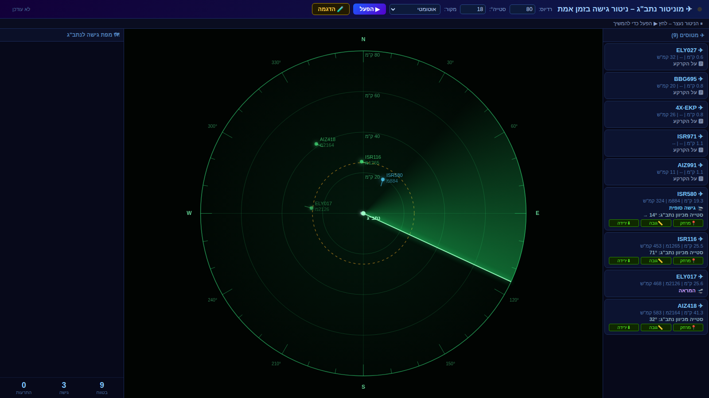
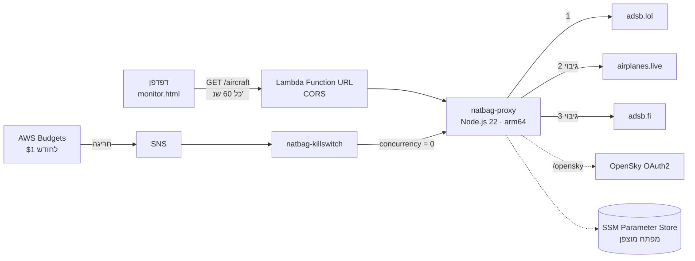
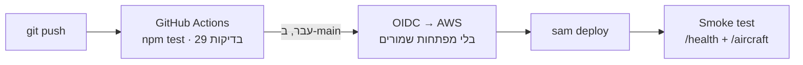

# ✈️ natbag-monitor – ניטור גישה לנתב"ג בזמן אמת


מערכת שמציגה בזמן אמת את המטוסים באזור נמל התעופה בן גוריון, על מסך רדאר סורק ועל מפת לוויין.
היא מזהה אוטומטית מטוסים בגישה לנחיתה ומתריעה כשמטוס בגישה הסופית סוטה מהכיוון לשדה.

**צפייה חיה:** `https://<USERNAME>.github.io/natbag-monitor/`



## ארכיטקטורה



## מה יש בפרויקט

**Frontend** (בלי build):
- `index.html`: דף פתיחה עם הסבר על המערכת ואנימציה של מטוס בדפוס המתנה.
- `monitor.html`: המערכת עצמה.

מה יש במערכת:
- מסך רדאר ב-Canvas: קרן סורקת, כל מטוס מוצג כנקודה במיקום ובמרחק האמיתיים שלו מהשדה, וטבעות מרחק.
- מפת לוויין (Leaflet ו-Esri) עם סימון אזור הגישה הסופית.
- רשימת מטוסים עם סטטוס לכל אחד: על הקרקע, המראה, בגישה או בגישה סופית.
- רענון אוטומטי כל דקה, שורת סטטוס שמראה איזה מקור נתונים ענה, ומצב הדגמה עם נתונים מדומים.

**Backend** (`natbag-aws/`, Infrastructure as Code עם AWS SAM):
- **Lambda עם Function URL:** פתרון ל-CORS, מעבר אוטומטי בין שלושה מקורות נתונים, מטמון של 10 שניות ודחיסת gzip (בערך פי 7 פחות תעבורה).
- **SSM Parameter Store:** מפתח OpenSky נשמר מוצפן ולא מופיע בקוד.
- **Budgets, SNS ו-Kill Switch:** כשהעלות החודשית עוברת 1$, שרת הביניים נכבה אוטומטית.
- **CloudWatch Logs:** הלוגים נשמרים 3 ימים, כדי שלא תצטבר עלות אחסון.
- **IAM:** לכל פונקציה יש רק את ההרשאות שהיא צריכה (least privilege).

## CI/CD



- **בדיקות** (`tests/`): 29 בדיקות עם `node:test` המובנה, בלי תלויות חיצוניות.
  - לוגיקת הזיהוי: המרות יחידות, זיהוי קרקע והמראה, גישה סופית, התרעה ומגמה. חלק מהבדיקות רצות על נתוני ADS-B אמיתיים מנתב"ג.
  - שרת הביניים: מעבר בין מקורות, מטמון, gzip ובדיקת קלט.
- **פריסה:** GitHub Actions מתחבר ל-AWS עם OIDC. ההרשאה ניתנת לתפקיד IAM מוגבל, רק ל-repo הזה ורק לסביבת `production`.
- **Smoke test:** אחרי כל פריסה ה-workflow בודק שהשרת החדש עונה.

## מדד חריגה בתנועה האווירית

תג בפינת הרדאר מציג את מצב התנועה האווירית סביב השדה: **רגיל**, **חריגה** או **חריגה משמעותית**.
המדד משקלל כמה סימנים, והקוד שלו נמצא ב-`airspaceStatus` ב-`detect.js`:

| סימן | איך מזהים |
|---|---|
| מטוסים בהמתנה | בשובל של 10 הדקות האחרונות סכום הפניות הוא 300° ומעלה (סיבוב מלא) |
| מטוסים שהסתובבו | מטוס שהיה בגישה, ועכשיו פונה מהשדה ומתרחק ממנו |
| נחיתות שנעצרו | אין מטוסים בגישה סופית ב-10 הדקות האחרונות, כשבשעה האחרונה היו בממוצע 1.5 ומעלה |
| ירידה חדה | מספר המטוסים באוויר ירד ל-40% או פחות מהממוצע |
| קודי חירום | מטוס שמשדר squawk 7700 או 7600 |

**שני סוגי התרעות, שונים זה מזה:**

| | התרעת מטוס בודד | התרעת תנועה אווירית |
|---|---|---|
| מתי | מטוס בגישה סופית סוטה מהכיוון לשדה | המדד עולה רמה (רגיל ← חריגה ← משמעותית) |
| תצוגה | חלון אדום במרכז המסך | פס כתום בראש המסך, או אדום-כתום בחריגה משמעותית |
| צליל | — | צליל קצר ושונה לכל רמה, עם השתקה |
| נוסף | — | התראת דפדפן כשהלשונית ברקע, סימן בכותרת הלשונית, הודעה על חזרה לשגרה והיסטוריה |

כדי להשוות לקצב הרגיל, המדד צריך לאסוף כ-10 דקות של נתונים. בשעות שיש בהן מעט תנועה, למשל בלילה, מחסור בנחיתות לא נחשב חריגה.

> ⚠️ זה מדד לתנועה האווירית בלבד. הוא **לא** מערכת התרעה ולא יודע לחזות אירועים ביטחוניים.
> להתרעות ולהנחיות משתמשים באפליקציית פיקוד העורף.

## לוגיקת הזיהוי

הקוד נמצא ב-`detect.js` ונבדק ב-`tests/detect.test.mjs`. המערכת לא בודקת פרמטר בודד. היא משלבת כמה נתונים מתוך ה-ADS-B כדי לצמצם התרעות שווא:

1. **סינון מטוסים על הקרקע:** מטוס עם `alt_baro = ground`, או מהירות מתחת ל-80 קמ"ש בגובה נמוך, לא משתתף בלוגיקה.
2. **זיהוי המראה:** מטוס שמטפס ביותר מ-2 מ'/ש' מסומן כהמראה ולא כגישה.
3. **גישה:** צריך שיתקיימו 2 מתוך 3 תנאים:
   - בתוך הרדיוס שנבחר
   - גובה מתחת ל-4,000 מ'
   - ירידה של יותר מ-1 מ'/ש'
4. **גישה סופית:** מטוס בגישה שנמצא עד 25 ק"מ מהשדה, מתחת ל-1,800 מ', ויורד.
5. **סטייה:** ההפרש בין כיוון הטיסה של המטוס (`track`) לבין הכיוון אל השדה. בודקים את זה רק בגישה הסופית, כי שם המטוס כבר אמור להיות מיושר למסלול.
6. **התרעה:** קופצת רק אם הסטייה גדולה מהסף במשך לפחות 3 קריאות רצופות (בערך דקה וחצי), ולא נמצאת במגמת שיפור.

המערכת ממירה גם יחידות: ADS-B מדווח ברגל, ברגל לדקה ובקשרים, והקוד עובד במטרים, במ'/ש' ובקמ"ש.

## הרצה

**צפייה:** פותחים את `index.html` (דף הפתיחה) או ישר את `monitor.html` בדפדפן, בלי התקנה ובלי שרת מקומי.

**הקמת ה-Backend** (ב-AWS CloudShell):
```bash
cd natbag-aws
sam deploy --guided
```
את ה-`ProxyUrl` שמתקבל מדביקים ב-`PROXY_URL` שב-`monitor.html`. הוראות מלאות נמצאות ב-[natbag-aws/README.md](natbag-aws/README.md).

## עלות

- **שימוש רגיל** (בקשה בדקה לכל צופה): **0$**, בתוך ה-Always Free של Lambda.
- **הגנה מחריגה:** תקציב של 1$ עם כיבוי אוטומטי.

## טכנולוגיות

`GitHub Actions` · `OIDC` · `node:test` · `JavaScript` · `HTML5 Canvas` · `Leaflet` · `AWS Lambda` · `AWS SAM / CloudFormation` · `SSM Parameter Store` · `AWS Budgets` · `SNS` · `CloudWatch` · `IAM` · `ADS-B`

## מקורות נתונים

- [adsb.lol](https://adsb.lol), [airplanes.live](https://airplanes.live) ו-[adsb.fi](https://adsb.fi): נתוני ADS-B פתוחים.
- [OpenSky Network](https://opensky-network.org): לשימוש לא מסחרי.
- צילומי לוויין: Esri World Imagery. מפות רחובות: © OpenStreetMap, © CARTO.

פרויקט אישי ללמידה. הוא לא מיועד לשימוש מבצעי או בטיחותי.
