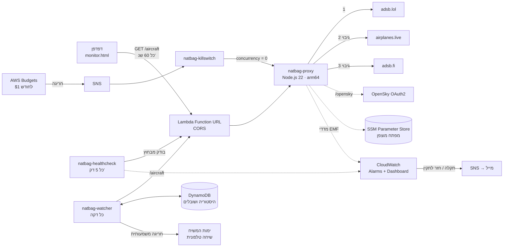
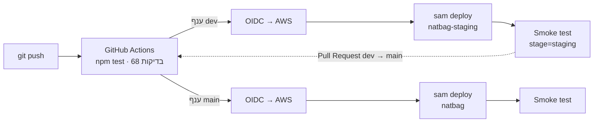

# ✈️ natbag-monitor – ניטור גישה לנתב"ג בזמן אמת


מערכת שמציגה בזמן אמת את המטוסים באזור נמל התעופה בן גוריון, על מסך רדאר סורק ועל מפת לוויין.
היא מזהה אוטומטית מטוסים בגישה לנחיתה ומתריעה כשמטוס בגישה הסופית סוטה מהכיוון לשדה.

**צפייה חיה:** `https://<USERNAME>.github.io/natbag-monitor/`


## ארכיטקטורה



## מה יש בפרויקט

**Frontend** (בלי build):
- `index.html`: דף פתיחה עם הסבר על המערכת ואנימציה של מטוס בדפוס המתנה.
- `monitor.html`: המערכת עצמה.

מה יש במערכת:
- מסך רדאר ב-Canvas: קרן סורקת, כל מטוס מוצג כנקודה במיקום ובמרחק האמיתיים שלו מהשדה, וטבעות מרחק.
- תצוגה מפוצלת (⊞ 4 מסכים): ארבעה מסכי רדאר, כל אחד מסונן לפי סוג: מטוסי נוסעים, מטוסי תדלוק (עם טווח שגדל לבד עד המטוס הרחוק), מטוסים קלים ומסוקים, וכל כלי הטיס. זו תצוגה בלבד, והתנאים של ההתרעות לא משתנים.
- מפת לוויין (Leaflet ו-Esri) עם סימון אזור הגישה הסופית.
- רשימת מטוסים עם סטטוס לכל אחד: על הקרקע, המראה, בגישה או בגישה סופית.
- רענון אוטומטי כל דקה, שורת סטטוס שמראה איזה מקור נתונים ענה, ומצב הדגמה עם נתונים מדומים.

**Backend** (`natbag-aws/`, Infrastructure as Code עם AWS SAM):
- **Lambda עם Function URL:** פתרון ל-CORS, מעבר אוטומטי בין שלושה מקורות נתונים, מטמון של 10 שניות ודחיסת gzip (בערך פי 7 פחות תעבורה).
- **SSM Parameter Store:** מפתח OpenSky נשמר מוצפן ולא מופיע בקוד.
- **Budgets, SNS ו-Kill Switch:** כשהעלות החודשית עוברת 1$, שרת הביניים נכבה אוטומטית.
- **CloudWatch Logs:** הלוגים נשמרים 3 ימים, כדי שלא תצטבר עלות אחסון.
- **ניטור:** מדדים, בדיקת זמינות כל 5 דקות, 7 התרעות במייל ולוח בקרה. פירוט בהמשך.
- **IAM:** לכל פונקציה יש רק את ההרשאות שהיא צריכה (least privilege).

## ניטור (Observability)

המערכת מנטרת את עצמה, כדי שאדע על תקלה לפני שמשתמש נתקל בה.

- **מדדים מהקוד (Embedded Metric Format):** השרת כותב שורת JSON מיוחדת ללוג, ו-CloudWatch הופך אותה למדד. בלי קריאות API ובלי הרשאות נוספות.
  - `SourceUsed{Source}`: איזה מקור ADS-B ענה (adsb.lol, airplanes.live או adsb.fi).
  - `UpstreamFailure{Route}`: מקור חיצוני שנכשל (ADS-B, מטוסים צבאיים, Flightradar24 או לוח הטיסות).
- **בדיקת זמינות חיצונית (`natbag-healthcheck`):** Lambda שרצה כל 5 דקות ובודקת מבחוץ, כמו משתמש, את `/health`, את `/aircraft` ואת האתר ב-GitHub Pages.
- **התרעות במייל (SNS), כולל הודעה כשהמצב חוזר לתקין:**

| התרעה | מתי |
|---|---|
| `natbag-healthcheck-failed` | בדיקת הזמינות נכשלה פעמיים ברצף |
| `natbag-proxy-errors` | השרת זרק שגיאה |
| `natbag-proxy-throttles` | בקשות נחסמות, למשל אחרי שמתג הכיבוי הופעל |
| `natbag-proxy-slow` | ‏p90 של זמן התגובה מעל 4 שניות במשך 15 דקות |
| `natbag-adsb-sources-down` | כל שלושת מקורות ה-ADS-B נפלו |
| `natbag-board-down` | לוח הטיסות של רשות שדות התעופה לא זמין, ולכן גם הקו הטלפוני |
| `natbag-watcher-errors` | המעקב בצד השרת נכשל, ולכן ההתרעה הטלפונית לא פועלת |

- **לוח בקרה (CloudWatch Dashboard `natbag`):** מצב ההתרעות, בקשות ושגיאות, זמני תגובה (p50 ו-p90), תוצאות בדיקת הזמינות, איזה מקור ענה, ואילו מקורות נכשלו. בתחתית יש טבלה של השגיאות האחרונות מתוך הלוגים (Logs Insights).

הכול מוגדר כקוד ב-`template.yaml` ונשאר בתוך ה-Free Tier: 7 התרעות מתוך 10, ו-10 מדדים מותאמים מתוך 10. DynamoDB ותזמון הריצה כל דקה עולים כמה סנטים בחודש.

## התרעה טלפונית על חריגה

`natbag-watcher` רץ בשרת כל דקה, גם כשאף דף לא פתוח. הוא מחשב את מדד החריגה באותה לוגיקה בדיוק כמו הדף: `detect.cjs` הוא עותק של `detect.js`, ובדיקה אוטומטית מוודאת שהשניים זהים. ההיסטוריה והשובלים נשמרים ב-DynamoDB.

כשהמדד עובר ל**חריגה משמעותית**, המערכת מתקשרת לטלפון שהוגדר דרך ימות המשיח (קמפיין עם הקראה) ומקריאה את הסיבות. יש לכל היותר שיחה אחת בחצי שעה, ואין שיחה חוזרת כל עוד המצב נשאר משמעותי. ציון המדד מוצג גם בלוח הבקרה.

## קו טלפוני (IVR) לטלפונים כשרים

מתקשרים ל[ימות המשיח](https://www.yemot.co.il) ובוחרים בתפריט:
- **1, בירור טיסה:** מקישים את מספר הטיסה ושומעים את הסטטוס, את שעת הנחיתה המתוכננת והמעודכנת, ואם המטוס באוויר גם את המרחק שלו מהשדה.
- **2, כלי הטיס סביב נמל התעופה:** המערכת מקריאה את כל כלי הטיס שבאוויר ברדיוס 100 ק"מ, מהקרוב לרחוק, שלושה בכל פעם. לכל אחד היא אומרת חברה ומספר טיסה (או מסוק או מטוס קל), דגם (למשל בואינג 787), מרחק, כיוון, גובה, והאם הוא בגישה לנחיתה בנתב"ג.
הנתונים מגיעים מלוח הטיסות של רשות שדות התעופה (data.gov.il) ומ-ADS-B. הקוד נמצא ב-`natbag-aws/src/proxy/flights.mjs`, וההוראות ב-[natbag-aws/README.md](natbag-aws/README.md).

## CI/CD



**שתי סביבות, מאותו קוד ומאותה תבנית:**

| | staging | production |
|---|---|---|
| ענף | `dev` | `main` |
| CloudFormation stack | `natbag-staging` | `natbag` |
| מה נפרס | רק שרת הביניים (`natbag-staging-proxy`) | שרת, תקציב, מתג כיבוי, ניטור והתרעות |
| GitHub Environment | `staging` | `production` |
| הדף | `monitor.html?env=staging` | `monitor.html` |

ההבדל נקבע בפרמטר `Stage` ב-`template.yaml` ובתנאי `IsProd`. ב-staging לא נשלחים מדדים ואין התרעות, כדי להישאר ב-Free Tier ולא לקבל מיילים על סביבת בדיקה.

- **בדיקות** (`tests/`): 68 בדיקות עם `node:test` המובנה, בלי תלויות חיצוניות.
  - לוגיקת הזיהוי: המרות יחידות, זיהוי קרקע והמראה, גישה סופית, התרעה ומגמה. חלק מהבדיקות רצות על נתוני ADS-B אמיתיים מנתב"ג.
  - שרת הביניים: מעבר בין מקורות, מטמון, gzip ובדיקת קלט.
- **פריסה:** GitHub Actions מתחבר ל-AWS עם OIDC. ההרשאה ניתנת לתפקיד IAM מוגבל, רק ל-repo הזה ורק לסביבת `production`.
- **Smoke test:** אחרי כל פריסה ה-workflow בודק שהשרת החדש עונה.

## סוג כלי הטיס

המערכת מסווגת כל כלי טיס לפי מה שהוא משדר ב-ADS-B: קטגוריית גודל, קוד דגם, דגל צבאי ו-callsign. הקוד נמצא ב-`aircraftClass` ב-`detect.js`.

| סוג | דוגמה | התרעות |
|---|---|---|
| ✈ נוסעים / מסחרי | ELY027 (B789), ISR580 (A320) | כן |
| 🛩 מטוס קל / פרטי | 4XHSG (EV97) | לא |
| 🚁 מסוק | קטגוריה A7 | לא |
| 🎖 צבאי | C-17 עם דגל צבאי | לא |
| ⛽ מטוס תדלוק צבאי | KC-135, KC-46, 707 | התרעה נפרדת |

התרעות הסטייה ומדד החריגה מתייחסים **רק למטוסי נוסעים**.

## התרעת מטוסי תדלוק

התרעה שלישית, נפרדת משתי האחרות: פס סגול עם ⛽ וצליל משלה.
היא קופצת כשמשדרים באזור (ממזרח הים התיכון ועד עיראק) **שני מטוסי תדלוק צבאיים או יותר של ארה"ב או ישראל**. המדינה נקבעת לפי טווח כתובת ה-ICAO של המטוס.
הנתונים מגיעים מ-`/v2/mil` של adsb.lol דרך נתיב `/mil` בשרת.

> הרשימה כוללת רק מטוסים שמשדרים ADS-B בפומבי. מטוסים צבאיים רבים טסים בלי שידור, ולכן הרשימה חלקית ואינה מעידה בהכרח על אירוע.

## התרעת טיסה עם הרבה עוקבים

התרעה רביעית, נפרדת מהאחרות: פס טורקיז עם 👁 וצליל משלה.
היא קופצת כשטיסה שנוחתת בנתב"ג או יוצאת ממנו, או מטוס שנמצא עכשיו באזור, נמצאת ברשימת **Most tracked** של Flightradar24 עם **מעל 1,000 עוקבים**. זה קורה בדרך כלל כשמשהו חריג קורה: חירום, נחיתה חריגה, טיסה מיוחדת.
השרת מושך את הרשימה לכל היותר פעם ב-2 דקות (נתיב `/tracked`), וההתאמה נעשית ב-`trackedStatus` ב-`detect.js`, לפי קוד שדה התעופה או לפי callsign.

> המקור לא רשמי: זו הכתובת שהאתר של Flightradar24 משתמש בה בעצמו, והשימוש בה לימודי בלבד. אם המקור חוסם או לא עונה, הפיצ'ר פשוט לא מוצג ושאר המערכת ממשיכה לעבוד.

## מדד חריגה בתנועה האווירית

תג בפינת הרדאר מציג את מצב התנועה האווירית סביב השדה: **רגיל**, **חריגה** או **חריגה משמעותית**.
המדד משקלל כמה סימנים, והקוד שלו נמצא ב-`airspaceStatus` ב-`detect.js`:

| סימן | איך מזהים |
|---|---|
| מטוסים בהמתנה | בשובל של 10 הדקות האחרונות סכום הפניות הוא 300° ומעלה (סיבוב מלא) |
| מטוסים שהסתובבו | מטוס שהיה בגישה, ועכשיו פונה מהשדה ומתרחק ממנו |
| נחיתות שנעצרו | אין מטוסים בגישה סופית ב-10 הדקות האחרונות, כשבשעה האחרונה היו בממוצע 1.5 ומעלה |
| ירידה חדה | מספר המטוסים באוויר ירד ל-40% או פחות מהממוצע |
| קודי חירום | מטוס שמשדר squawk 7700 או 7600 |

**שני סוגי התרעות, שונים זה מזה:**

| | התרעת מטוס בודד | התרעת תנועה אווירית |
|---|---|---|
| מתי | מטוס בגישה סופית סוטה מהכיוון לשדה | המדד עולה רמה (רגיל ← חריגה ← משמעותית) |
| תצוגה | חלון אדום במרכז המסך | פס כתום בראש המסך, או אדום-כתום בחריגה משמעותית |
| צליל | — | צליל קצר ושונה לכל רמה, עם השתקה |
| נוסף | — | התראת דפדפן כשהלשונית ברקע, סימן בכותרת הלשונית, הודעה על חזרה לשגרה והיסטוריה |

כדי להשוות לקצב הרגיל, המדד צריך לאסוף כ-10 דקות של נתונים. בשעות שיש בהן מעט תנועה, למשל בלילה, מחסור בנחיתות לא נחשב חריגה.

> ⚠️ זה מדד לתנועה האווירית בלבד. הוא **לא** מערכת התרעה ולא יודע לחזות אירועים ביטחוניים.
> להתרעות ולהנחיות משתמשים באפליקציית פיקוד העורף.

## לוגיקת הזיהוי

הקוד נמצא ב-`detect.js` ונבדק ב-`tests/detect.test.mjs`. המערכת לא בודקת פרמטר בודד. היא משלבת כמה נתונים מתוך ה-ADS-B כדי לצמצם התרעות שווא:

1. **סינון מטוסים על הקרקע:** מטוס עם `alt_baro = ground`, או מהירות מתחת ל-80 קמ"ש בגובה נמוך, לא משתתף בלוגיקה.
2. **זיהוי המראה:** מטוס שמטפס ביותר מ-2 מ'/ש' מסומן כהמראה ולא כגישה.
3. **גישה:** צריך שיתקיימו 2 מתוך 3 תנאים:
   - בתוך הרדיוס שנבחר
   - גובה מתחת ל-4,000 מ'
   - ירידה של יותר מ-1 מ'/ש'
4. **גישה סופית:** מטוס בגישה שנמצא עד 25 ק"מ מהשדה, מתחת ל-1,800 מ', ויורד.
5. **סטייה:** ההפרש בין כיוון הטיסה של המטוס (`track`) לבין הכיוון אל השדה. בודקים את זה רק בגישה הסופית, כי שם המטוס כבר אמור להיות מיושר למסלול.
6. **התרעה:** קופצת רק אם הסטייה גדולה מהסף במשך לפחות 3 קריאות רצופות (בערך דקה וחצי), ולא נמצאת במגמת שיפור.

המערכת ממירה גם יחידות: ADS-B מדווח ברגל, ברגל לדקה ובקשרים, והקוד עובד במטרים, במ'/ש' ובקמ"ש.

## הרצה

**צפייה:** פותחים את `index.html` (דף הפתיחה) או ישר את `monitor.html` בדפדפן, בלי התקנה ובלי שרת מקומי.

**הקמת ה-Backend** (ב-AWS CloudShell):
```bash
cd natbag-aws
sam deploy --guided
```
את ה-`ProxyUrl` שמתקבל מדביקים ב-`PROXY_URL` שב-`monitor.html`. הוראות מלאות נמצאות ב-[natbag-aws/README.md](natbag-aws/README.md).

## עלות

- **שימוש רגיל** (בקשה בדקה לכל צופה): **0$**, בתוך ה-Always Free של Lambda.
- **הגנה מחריגה:** תקציב של 1$ עם כיבוי אוטומטי.

## טכנולוגיות

`GitHub Actions` · `OIDC` · `node:test` · `CloudWatch Alarms / Dashboards / EMF` · `EventBridge` · `JavaScript` · `HTML5 Canvas` · `Leaflet` · `AWS Lambda` · `AWS SAM / CloudFormation` · `SSM Parameter Store` · `AWS Budgets` · `SNS` · `CloudWatch` · `IAM` · `ADS-B`

## מקורות נתונים

- [adsb.lol](https://adsb.lol), [airplanes.live](https://airplanes.live) ו-[adsb.fi](https://adsb.fi): נתוני ADS-B פתוחים.
- [OpenSky Network](https://opensky-network.org): לשימוש לא מסחרי.
- [Flightradar24](https://www.flightradar24.com) Most tracked: מקור לא רשמי, לשימוש לימודי.
- צילומי לוויין: Esri World Imagery. מפות רחובות: © OpenStreetMap, © CARTO.

פרויקט אישי ללמידה. הוא לא מיועד לשימוש מבצעי או בטיחותי.
