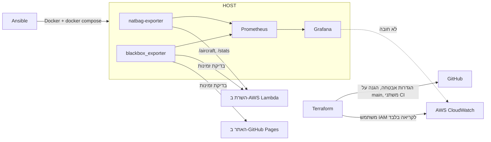

# ops – ניטור, תשתית כקוד ואוטומציה

שלושה כלים, כל אחד עם תפקיד אמיתי במערכת:



| תיקייה | מה יש בה |
|---|---|
| `monitoring/` | Prometheus, Grafana (מקורות נתונים ולוח בקרה מוגדרים כקוד), blackbox_exporter, ו-`natbag-exporter` שהופך את נתוני המטוסים והסטטיסטיקה למדדים. 8 כללי התרעה עם בדיקות יחידה (`promtool test rules`). |
| `ansible/` | Playbook שמתקין Docker ומפעיל את כל מערך הניטור על מכונת Ubuntu/Debian – היום WSL2 במחשב, מחר Raspberry Pi עם מקלט. |
| `terraform/` | הגדרות ה-repo ב-GitHub כקוד (סריקת סודות, Push protection, Dependabot, הגנה על main, משתנה ה-OIDC) ומשתמש IAM לקריאה בלבד מ-CloudWatch בשביל Grafana. |

## natbag-exporter – אילו מדדים

| מדד | מה הוא |
|---|---|
| `natbag_aircraft{move="arr\|dep\|other"}` | כלי טיס באוויר בטווח 100 ק"מ: נוחתים, ממריאים ואחרים. אותו סיווג כמו בקו הטלפוני (`planesNear` מ-`flights.mjs`). |
| `natbag_aircraft_by_kind{kind}` | נוסעים, קלים, מסוקים, צבאיים |
| `natbag_landings_today`, `natbag_departures_today` | מהסטטיסטיקה שנאספת ב-AWS כל דקה |
| `natbag_anomaly_seconds_today{level}`, `natbag_deviation_alerts_today` | חריגות והתרעות היום |
| `natbag_uptime_30d_percent`, `natbag_last_healthcheck_age_seconds` | מצב המערכת |
| `natbag_api_up{endpoint}`, `natbag_api_response_seconds{endpoint}` | האם השרת עונה ותוך כמה זמן |

## הרצה ראשונה (Windows)

1. **Ubuntu בתוך Windows (WSL2):** ב-PowerShell כמנהל: `wsl --install -d Ubuntu`, ואז הפעלה מחדש.
   ב-Ubuntu מוודאים ש-systemd פועל: בקובץ `/etc/wsl.conf` צריכות להיות השורות `[boot]` ו-`systemd=true` (אם הוספתם – `wsl --shutdown` ב-PowerShell ופותחים שוב).
2. **Ansible:**
   ```bash
   sudo apt update && sudo apt install -y ansible git
   git clone https://github.com/ackerme/natbag-monitor.git && cd natbag-monitor/ops/ansible
   read -s -p "סיסמה ל-Grafana (12 תווים לפחות): " GRAFANA_ADMIN_PASSWORD; export GRAFANA_ADMIN_PASSWORD; echo
   ansible-playbook site.yml --ask-become-pass
   ```
3. **פותחים בדפדפן:** Grafana ב-http://localhost:3000 (לוח הבקרה "מוניטור נתב"ג – תפעול" נפתח לבד), Prometheus ב-http://localhost:9090 (לשונית Alerts).

עדכון לגרסה חדשה מ-GitHub: מריצים שוב את אותה פקודת `ansible-playbook`.

## Terraform

```bash
cd ops/terraform
export GITHUB_TOKEN=...      # fine-grained token ל-repo הזה: Administration, Variables, Secrets – Read and write
terraform init
terraform plan               # קודם בודקים מה ישתנה
terraform apply
```
בהרצה הראשונה Terraform **מייבא** את ה-repo ואת המשתנה הקיים (בלוקי `import`) ולא יוצר אותם מחדש.
אחרי ה-apply, אם רוצים גרפים של Lambda בתוך Grafana: מריצים ב-CloudShell את הפקודה שמופיעה ב-`create_grafana_key_command`, ומעתיקים את המפתח ל-`ops/monitoring/.env` בלבד (או ל-`group_vars` מוצפן עם `ansible-vault`).

## אבטחה

- Prometheus ו-Grafana מאזינים רק ל-`127.0.0.1` – לא נגישים מהרשת.
- כל הקונטיינרים עם `no-new-privileges`; ה-exporter רץ כמשתמש `node` (לא root) עם מערכת קבצים לקריאה בלבד.
- סיסמת Grafana והמפתחות נשמרים ב-`.env` עם הרשאות `0600`, ו-`.env` / `*.tfstate` ב-`.gitignore`.
- מפתח ה-IAM לא נוצר ב-Terraform, כדי שלא יישמר כטקסט גלוי ב-state.
- ב-CI: `promtool`, `terraform validate`, `ansible-lint`, `docker compose config` ובניית ה-exporter, ו-Checkov סורק גם את ה-Terraform וה-Dockerfile.
